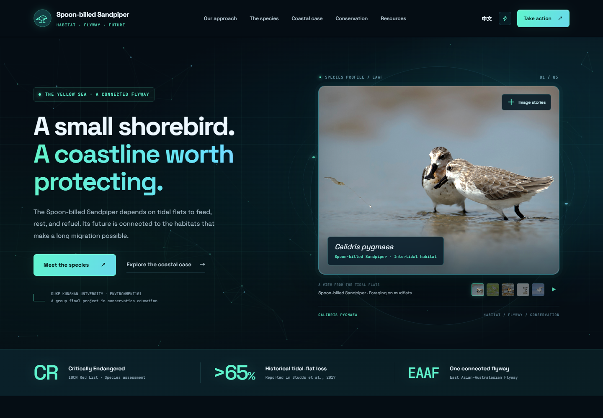
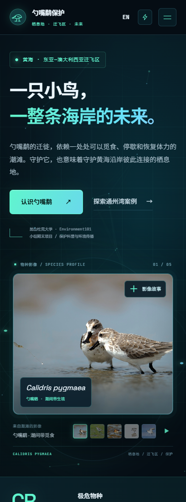

<p align="center">CONSERVATION EDUCATION · YELLOW SEA · ZH / EN</p>

# Spoon-billed Sandpiper Conservation

A bilingual, interactive website exploring the Spoon-billed Sandpiper, the habitats that support its migration, and the relationship between coastal development and habitat function.

Developed as the **group final project for Environment101 at Duke Kunshan University**, the site connects conservation ecology with accessible environmental communication.

**[Explore the website ↗](https://will1202.github.io/sbs-conservation-site/)** · [中文版介绍](README.zh-CN.md) · [Sources and Materials](docs/SOURCES.md)



## Project Context

Migrating shorebirds need places to feed, rest, and refuel. This project uses the Spoon-billed Sandpiper as an entry point into a wider question: how can coastal habitats continue to serve those functions as their surroundings change?

The narrative follows the Yellow Sea flyway, introduces indirect ecological effects, and uses Tongzhou Bay materials from the course project to discuss spatial connections between development, tidal flats, and high-tide roosts.

It is a conservation education and communication project. The case materials illustrate possible impact pathways; site-specific ecological conclusions require field monitoring and assessment.

## Explore the Site

| Section | What It Covers |
| --- | --- |
| **Our Approach** | Habitat function, flyway connectivity, and the role of evidence. |
| **The Species** | Species information, an interactive knowledge check, and selectable flyway habitat nodes. |
| **Coastal Case** | Habitat-pressure tabs, a Tongzhou Bay planning image, and a photographic case gallery. |
| **Conservation** | Six directions for planning, monitoring, collaboration, and disturbance reduction. |
| **Take Action** | Responsible observation, source-aware sharing, and a copyable ecological connection. |
| **Resources** | Species profiles, published research, and the original PDF and spreadsheet materials. |

The habitat-node diagram is an ecological schematic. Jiangsu is part of the Yellow Sea stopover region; the diagram is not an individual bird’s tracked route.

## Design and Interaction

The visual design combines a midnight blue background, mint and cyan accents, glass panels, and photographs retained from the original project. Particle connections, orbital lines, and subtle hover lighting complement numbered sections that guide the reader from species knowledge to conservation questions.

Decorative motion can be paused with the lightning button in the navigation. The site also respects the system’s reduced-motion preference and suspends the particle animation while the hero is outside the viewport or the browser tab is hidden.

- **Chinese and English:** the language switch updates page copy, image captions, quiz feedback, and habitat descriptions. The browser remembers the reader’s choice.
- **Responsive navigation:** desktop navigation becomes an expandable menu on smaller screens.
- **Interactive learning:** quiz answers show explanatory feedback; habitat nodes and threat tabs reveal more detail.
- **Image exploration:** selectable hero photographs and image dialogs support keyboard navigation. Automatic playback is optional.
- **Accessible controls:** visible keyboard focus, labelled controls, arrow-key tabs, dialog focus handling, and reduced-motion support.

<details>
<summary>View the mobile presentation</summary>

<p align="center"></p>

</details>

## Technology

| Layer | Implementation |
| --- | --- |
| Structure | Semantic HTML5 |
| Presentation | CSS Grid, Flexbox, and responsive media queries |
| Interaction | Vanilla JavaScript and browser APIs |
| Translation | A shared Chinese/English dictionary in `i18n.js` |
| Image Content | A local manifest in `assets.json` |
| Hosting | GitHub Pages |

The site runs as static files with no build step or package installation. Fonts load from Google Fonts when available, with system fallbacks.

## Run Locally

Clone the repository and start a local HTTP server using Python 3:

```sh
git clone https://github.com/Will1202/sbs-conservation-site.git
cd sbs-conservation-site
python -m http.server 8000
```

Open **[localhost:8000](http://localhost:8000)**. Use an HTTP server so the browser can load the image manifest through `fetch()`.

The links `/?lang=en` and `/?lang=zh` open a specific language. They also work on the [published website](https://will1202.github.io/sbs-conservation-site/?lang=en).

## Repository Structure

```text
sbs-conservation-site/
├── index.html                # Page structure, metadata, and resource links
├── styles.css                # Visual design and responsive layouts
├── app.js                    # Navigation, translations, quiz, galleries, and dialogs
├── effects.js                # Optional particle, pointer, and reading-progress effects
├── i18n.js                   # Chinese and English interface copy
├── assets.json               # Photograph paths and bilingual captions
├── images/                   # Original project images and site icon
├── docs/
│   ├── SOURCES.md             # Source context and material provenance
│   ├── previews/              # Screenshots of the implemented website
│   ├── CCWC_2012-2019.pdf     # Original supplementary report
│   └── CW2012-2019_Dongling.xlsx
├── README.md
└── README.zh-CN.md
```

## Evidence and Materials

The site links to IUCN, BirdLife, Studds et al. (2017), and an EAAFP MOP12 species action-plan document. The **>65%** tidal-flat-loss figure is historical context reported in the 2017 paper, not a live measurement or an analysis produced by this project. [Source details](docs/SOURCES.md).

The PDF, spreadsheet, photographs, and case images remain part of the original course-project materials. Their inclusion does not establish a single reuse license. No repository-wide license is currently specified; confirm the relevant permissions before reusing third-party materials.

## Project Attribution

**Environment101 · Duke Kunshan University · Group Final Project.** This repository preserves the project’s group-coursework context and presents its conservation content as an educational resource.
