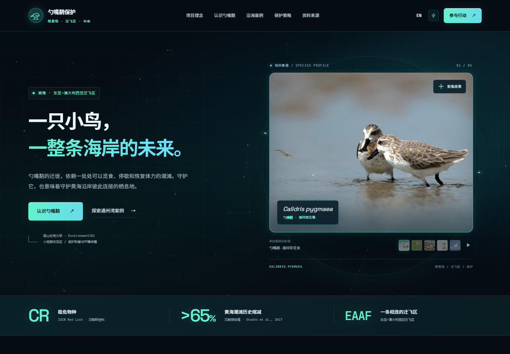

<p align="center">保护科普 · 黄海迁飞区 · 中英双语</p>

# 勺嘴鹬保护：栖息地与迁飞区

一个中英双语、可交互的保护科普网站。项目围绕勺嘴鹬的迁徙与栖息地需求，探讨沿海开发、空间连通性和栖息地功能之间的关系。

本项目是**昆山杜克大学 Environment101 课程的小组期末项目**，将保护生态学知识转化为便于公众理解的网页内容。

**[访问网站 ↗](https://will1202.github.io/sbs-conservation-site/)** · [English](README.md) · [资料与来源](docs/SOURCES.md)



## 项目背景

迁徙滨鸟需要能够觅食、停歇和补充能量的栖息地。本项目以勺嘴鹬为切入点，讨论沿海环境变化时，如何理解和维持这些生态功能。

网站从黄海迁飞区展开，介绍间接生态影响，并结合课程收集的通州湾规划与开发材料，帮助读者理解潮滩、高潮栖息地与开发布局之间的空间联系。

项目定位为保护科普与环境传播。通州湾案例用于解释潜在影响路径；具体项目的生态影响仍需要现场监测与评估。

## 网站内容

| 板块 | 主要内容 |
| --- | --- |
| **项目理念** | 栖息地功能、迁飞区连通性与证据的作用。 |
| **认识物种** | 物种知识、带解释反馈的小测与可点击的栖息地节点。 |
| **沿海案例** | 不同栖息地压力、通州湾规划图和案例影像。 |
| **保护策略** | 规划、监测、协作与减少干扰等六个讨论方向。 |
| **参与行动** | 负责任的观察、有来源的信息分享，以及可复制的生态联系。 |
| **资料来源** | 物种资料、研究文献，以及原有 PDF 报告与数据表。 |

栖息地节点图是简化生态示意。江苏沿海属于黄海停歇区域，节点排列不代表地理地图或某只鸟的追踪路线。

## 设计与交互

页面以深蓝黑为底色，结合青绿与冰蓝高光、玻璃面板和项目原有摄影。粒子连线、环形光轨与悬停光晕配合清晰的文字层级和编号章节，引导读者从物种知识逐步理解保护问题。

导航栏中的闪电按钮可以暂停视觉动效。页面也遵循系统的减少动态效果偏好，并在首屏移出可视区域或浏览器标签页隐藏时暂停粒子动画。

- **中英切换：**同时更新页面文案、图片说明、问答反馈和栖息地描述；浏览器保存语言选择。
- **响应式导航：**桌面导航在较小屏幕上转换为可展开菜单。
- **互动学习：**小测提供解释反馈；栖息地节点与威胁标签展示不同内容。
- **影像浏览：**首页照片可以手动选择，自动轮播由读者主动开启；图片弹窗支持键盘切换。
- **无障碍操作：**提供清晰的键盘焦点、带标签的控件、方向键标签切换、弹窗焦点管理和减少动态效果支持。

<details>
<summary>查看手机端预览</summary>

<p align="center"></p>

</details>

## 技术实现

| 层次 | 实现方式 |
| --- | --- |
| 页面结构 | 语义化 HTML5 |
| 样式布局 | CSS Grid、Flexbox 与响应式媒体查询 |
| 页面交互 | 原生 JavaScript 与浏览器 API |
| 双语文案 | `i18n.js` 中的中英词典 |
| 图片内容 | `assets.json` 中的本地资源清单 |
| 网站托管 | GitHub Pages |

项目以静态文件运行，无需构建或安装依赖。字体在可用时通过 Google Fonts 加载，并提供系统字体回退。

## 本地运行

安装 Python 3 后，在终端运行：

```sh
git clone https://github.com/Will1202/sbs-conservation-site.git
cd sbs-conservation-site
python -m http.server 8000
```

打开 **[localhost:8000](http://localhost:8000)**。本地 HTTP 服务可以让浏览器正常通过 `fetch()` 读取图片清单。

可在地址末尾添加 `/?lang=zh` 或 `/?lang=en` 指定语言；[线上英文入口](https://will1202.github.io/sbs-conservation-site/?lang=en)也支持这个参数。

## 项目结构

```text
sbs-conservation-site/
├── index.html                # 页面结构、分享元信息与资料链接
├── styles.css                # 视觉样式与响应式布局
├── app.js                    # 导航、双语、问答、图集与弹窗
├── effects.js                # 可暂停的粒子、鼠标光效与阅读进度
├── i18n.js                   # 中英界面文案
├── assets.json               # 图片路径与双语图片说明
├── images/                   # 原有图片与网站图标
├── docs/
│   ├── SOURCES.md             # 来源背景与资料说明
│   ├── previews/              # 实际页面截图
│   ├── CCWC_2012-2019.pdf     # 原有补充报告
│   └── CW2012-2019_Dongling.xlsx
├── README.md
└── README.zh-CN.md
```

## 资料与来源

网站提供 IUCN、BirdLife、Studds 等人的 2017 年论文，以及 EAAFP MOP12 物种行动计划相关文件的阅读入口。页面中的 **>65%** 是 2017 年文献报告的历史潮滩缩减背景，不是实时数值或本项目计算结果。详细信息见[资料与来源说明](docs/SOURCES.md)。

原有 PDF、表格、摄影和案例图片均保留。仓库目前未指定统一的开源许可，第三方素材可能具有各自的使用条件；再次使用时应核对相关授权。

## 项目归属

**昆山杜克大学 · Environment101 · 小组期末项目。** 仓库保留原有课程与小组项目背景，将保护内容呈现为教育资源。
